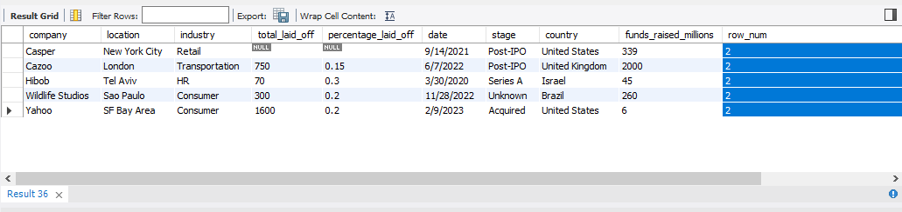
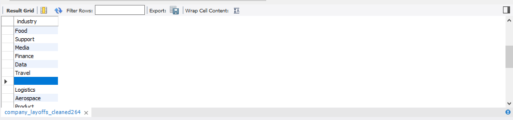
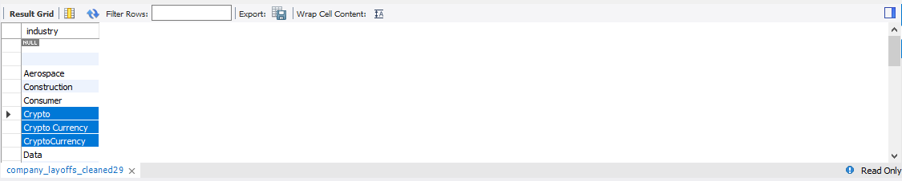
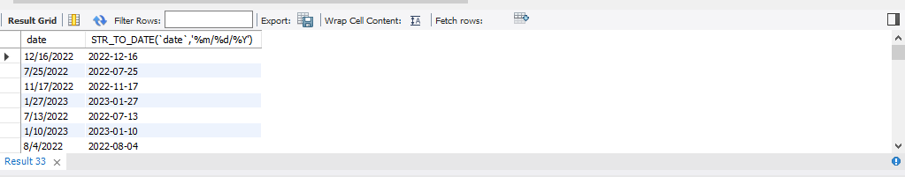
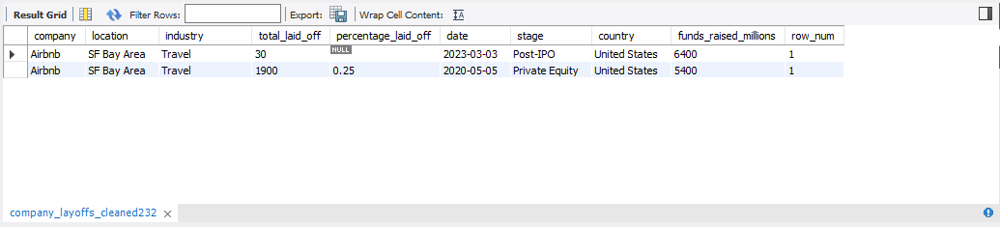

# 📊 Data Cleaning Project - MySQL

## About the project

This project was developed as a comprehensive data cleaning exercise using SQL, simulating a real-world scenario with raw information.  
The goal was to apply best practices for cleaning, standardization, and validation, with a strong focus on the quality and usability of the final data.

🔗 **Full SQL code:** [`data_cleaning.sql`](./data_cleaning.sql)

---

## 📌 Table of Contents

1. [Description](#description)  
2. [Objective](#objective)  
3. [Step-by-step cleaning process](#step-by-step-cleaning-process)  
   - [STEP 1: Duplicate Removal](#step-1-duplicate-removal)  
   - [STEP 2: Data Standardization](#step-2-data-standardization)  
   - [STEP 3: Handling Null Values](#step-3-handling-null-values)  
   - [STEP 4: Removing NULL Records and Unnecessary Columns](#step-4-removing-null-records-and-unnecessary-columns)  
4. [Final Result](#final-result)  
5. [Possible Improvements](#possible-improvements)  

---

## Description

This project demonstrates how to **clean and prepare a database using only SQL**, just like in real-life data workflows.  
The original dataset contained common issues such as **duplicates, empty values, inconsistent formats, and unnecessary columns**.

Key steps applied in the process:
- **Duplicate removal**  
- **Null value handling**  
- **Data normalization**  
- **Final table restructuring**  

As a result, we obtained a **clean and reliable dataset**, ready to be used in tools like **Tableau, Power BI, or Machine Learning models**.

🛠️ **Technology used:** `SQL`  
📊 **Practical use case:** Making data **clean and ready for analysis, visualization, or prediction**

---

## Objective

The goal of this project is to **demonstrate how to transform a messy dataset into a clean, structured, and analysis-ready database**.

This includes:
- **Detecting and fixing data issues**  
- **Standardizing fields** to ensure consistency  
- Ensuring the final table is **clear, functional, and reusable**

It’s a practical example of how data is prepared in real-world roles related to **Data Analysis**, **Business Intelligence**, or **Data Engineering**.

---

## Step-by-step cleaning process

### 📂 Original Dataset

Below is a preview of the original dataset:

### 📏 Dataset Dimensions

The dataset contains a significant number of rows and columns, which makes it even more important to ensure data quality before any analysis:

---

## Creating a working table

Before starting the cleaning process, a **working table** was created from the original dataset.  
This is a common practice in professional data environments, as it allows safe and organized work without affecting the original information.

An exact copy of the structure and data from the `company_layoffs` table was created as a new table called `company_layoffs_cleaned`, where all transformations were applied.

### Benefits of working with a copy

- **Preserve the original source** in case of errors or data loss  
- **Test various cleaning techniques** without affecting the base data  
- **Quickly roll back changes** if issues arise

---

## STEP 1: Duplicate Removal

Duplicate records can distort analysis and visualizations, leading to **incorrect or inconsistent results**. The first step was to detect and remove these repeated entries.

### Identifying duplicates

- The `ROW_NUMBER()` function was used to assign a sequential number to each row, grouped by key columns.  
- The goal was to keep only one record and remove those with `row_num > 1`.

Duplicate rows identified:

Example of duplicates for the company `Oda`:

---

### Challenges when removing duplicates

An attempt was made to delete duplicate records directly from a CTE using `ROW_NUMBER()`:

However, MySQL returned the following error:

**Error 1288:**  
*"The target table of the DELETE is not updatable."*

**Technical cause:**  
MySQL does not allow `DELETE` operations on derived tables such as CTEs (Common Table Expressions), as they are not updatable.

**Solution applied:**

- A new table `company_layoffs_cleaned2` was created, copying all data from the previous one  
- A `row_num` column (type `INT`) was manually added to this table  
- With this structure, it was possible to safely execute the `DELETE` command

---

### Final duplicate deletion

Once `company_layoffs_cleaned2` was created, all rows with `row_num > 1` were removed.

Before deletion:

After deletion:

---

## STEP 2: Data Standardization

### Trimming white spaces — Column `company`

To ensure consistency in company names, the `TRIM()` function was applied to remove leading and trailing spaces.

This avoids inconsistencies like duplicate entries caused by invisible differences:

For example: `" E Inc."` vs `"E Inc."`

**Dataset after standardization:**

After applying `TRIM()`, the values in the `company` column became more consistent and clean.

---

### Analyzing the `industry` column

#### Issue 1: Empty or NULL values

Several rows had missing values in the `industry` column, which could affect grouped analysis or segmentation.

Example of NULL values:

  

**Solution applied:**

- NULL values were completed using info from other rows of the same company (e.g. if `Airbnb` had "Travel" in one row, it was copied to others)  
- If no reliable data was found, the field remained as `NULL` to avoid assumptions

✔ **Result:** Fewer missing values without introducing biased data

---

#### Issue 2: Inconsistent naming

Variations in naming were found for the same category (e.g., "Crypto", "crypto", "Cryptocurrency").

**Before standardization:**

**After standardization:**

✅ All values were unified using a common naming convention for cleaner grouping and filtering.

---

### Analyzing the `country` column

Unnecessary characters were removed, and country names were standardized to prevent duplicates caused by different spellings.

For example: `"United States"` vs `"United States."`

---

### Converting `date` column to DATE format

Originally, the `date` column was stored as `TEXT`, which made it hard to perform date-based filtering or time operations.

The `STR_TO_DATE()` function was used to convert the values, followed by an `ALTER TABLE` to change the column type.

**Conversion:**  
On the left, the original format; on the right, the converted format

**After the `UPDATE`:**

**After altering column type:**

✅ **Final Result:** The `date` column is now in proper `DATE` format, ready for filtering, aggregation, and time-based reporting.

---

## STEP 3: Handling Null Values

This step focused on identifying and treating missing values in the `industry` column to improve overall data quality and enable cleaner SQL queries.

### Replacing empty strings

Empty string values were replaced with `NULL` for proper handling in SQL, as many functions and filters are designed to work with `NULL` but not with empty spaces.

---

### Filling NULLs using JOIN

A `JOIN` was used to fill in `NULL` values in the `industry` column using data from other rows with the same company name.

📌 This approach avoids inserting arbitrary data and maintains logical consistency in the dataset.

---

### Verifying the result

After the `JOIN`, a `SELECT` query was executed to confirm that the missing values had been filled in correctly.

---

### Final result

After applying the `UPDATE`, all companies have an assigned industry **when it was possible to infer it confidently** from existing data.  
For example, all rows with `company = Airbnb` now correctly show `industry = Travel`.

## STEP 4: Removing NULL Records and Unnecessary Columns

In this stage, the dataset was refined by removing information that does not add value to the final analysis. This improves data quality, efficiency, and interpretability.

---

### Removing rows with missing data: `total_laid_off` and `percentage_laid_off` (Logic condition: 'AND')

All rows where both `total_laid_off` and `percentage_laid_off` were empty were removed.  
Although they could have been kept, the missing data adds uncertainty and can distort results.

Before removing NULL rows:  

After removal:  

#### Why remove them?

- ✅ **Incomplete data and risk of bias:** These are key variables to understand the impact of layoffs. Keeping them empty weakens the analysis.  
- ✅ **Unreliable imputation:** There's not enough context to fill them in accurately without compromising the dataset.  
- ✅ **Negative impact on visualizations and models:** Some BI tools or ML models do not handle `NULL` well, which can cause errors or misleading results.

---

### Removing the `row_num` column

The `row_num` column was used only for debugging and sorting purposes during earlier steps (e.g., identifying duplicates).  
Once that process was complete, it became irrelevant for further analysis.

#### Why remove it?

- ✅ **Avoid redundancy:** It does not provide analytical value.  
- ✅ **Reduce size and improve structure:** Removing unnecessary columns improves performance and simplifies data handling.  
- ✅ **Makes export and visualization easier:** A lighter dataset is more efficient when working with Tableau, Power BI, Pandas, etc.

---

## 📊 Final Result

After applying the full cleaning and transformation process, the result is a **structured, reliable, and analysis-ready dataset**.

✔ **No duplicates or errors:** Redundant records and inconsistencies were removed  
✔ **Homogeneous structure:** Data was normalized and columns standardized  
✔ **Higher quality and accuracy:** NULL values were reduced and the dataset was optimized

*This kind of cleaning is a critical step in any data pipeline, ensuring a solid foundation for dashboards, reports, or predictive modeling.*

---

## Possible Improvements

Although the dataset is now clean and usable, in a real-world environment further improvements could include:

- Automating the process with parameterized SQL scripts  
- Adding data validation rules or triggers  
- Enriching the dataset by merging with external sources  
- Integrating this cleaning phase into a full ETL pipeline

💡 *A practical demonstration of how to use SQL to solve real-world data problems with technical rigor and attention to detail.*