# 📊 Proyecto de Data Cleaning - MySQL

## 📌 Contenido  

1. [Descripción](#Descripción)  
2. [Objetivo](#Objetivo)  
3. [Proceso de limpieza paso a paso](#Proceso-de-limpieza-paso-a-paso)  
   - [PASO 1: Eliminación de Duplicados](#paso-1-eliminación-de-duplicados)  
   - [PASO 2: Estandarización de Datos](#paso-2-estandarización-de-datos)  
   - [PASO 3: Manejo de valores nulos](#paso-3-manejo-de-valores-nulos)  
   - [PASO 4: Eliminación de datos NULL y columnas innecesarias](#paso-4-eliminación-de-datos-null-y-columnas-innecesarias)  
4. [Resultado final](#-resultado-final)  
  
---

## Descripción
Este proyecto muestra cómo **limpiar y preparar una base de datos usando solo SQL**, tal como se hace en escenarios reales de trabajo.  
El dataset original contenía errores comunes como **duplicados, valores vacíos, formatos inconsistentes y columnas innecesarias**.

Durante el proceso se aplicaron pasos clave como:
- **Eliminación de duplicados**  
- **Tratamiento de valores nulos**  
- **Normalización de datos**  
- **Reestructuración de la tabla final**  

Con esto, se obtiene un **dataset confiable y ordenado**, listo para usar en herramientas como **Tableau, Power BI o en modelos de Machine Learning**.

🛠️ **Tecnología usada:** `SQL`  
📊 **Uso práctico:** Dejar los datos **limpios y listos para análisis, visualización o predicción**.

## **Objetivo** 
El objetivo de este proyecto es **mostrar cómo transformar un conjunto de datos desordenado en una base limpia, estructurada y útil para análisis**.

Esto incluye:
- **Detectar y corregir errores** en los datos.
- **Estandarizar campos** para lograr consistencia.  
- Asegurar que la tabla final sea **clara, funcional y reutilizable**.

Es un ejemplo práctico de cómo se trabaja con datos reales en cualquier puesto relacionado con **Data Analysis**, **Business Intelligence** o **Data Engineering**.

--- 

## Proceso de limpieza paso a paso

### 📂 Dataset original

A continuación se muestra una vista previa del dataset recibido:

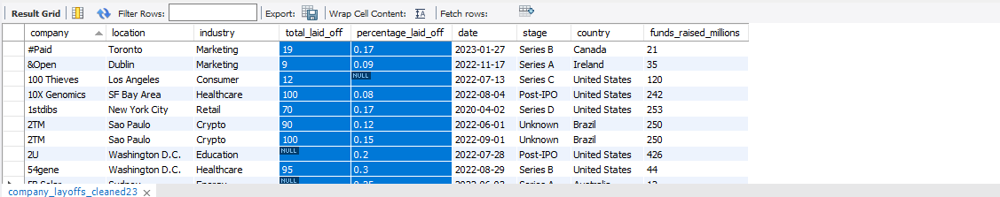

### 📏 Dimensión del dataset

El conjunto de datos original cuenta con una cantidad significativa de registros y columnas, lo cual hace aún más importante asegurar su calidad antes de analizarlo:

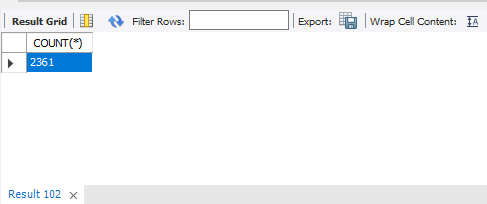

---

## Creación de una tabla de trabajo

Antes de iniciar el proceso de limpieza, se crea una **tabla de trabajo** a partir del dataset original.  
Esta es una buena práctica común en entornos profesionales de análisis de datos, ya que permite trabajar de forma segura, ordenada y sin comprometer la información original.

Se realiza una copia exacta de la estructura y los datos de la tabla `company_layoffs`, creando una nueva tabla llamada `company_layoffs_cleaned`, sobre la cual se aplicarán todas las transformaciones necesarias.

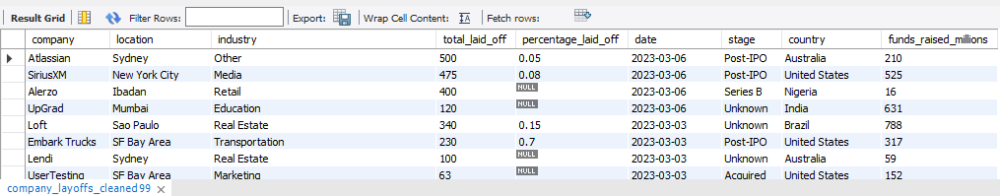

### Ventajas de trabajar con una copia

- **Preservar la fuente de datos original** ante cualquier error o pérdida de información.  
- **Probar distintas técnicas de limpieza** sin afectar el dataset base.  
- **Permitir retrocesos y ajustes rápidos** si se detectan problemas durante el proceso.

---

## PASO 1: Eliminación de Duplicados

Los datos duplicados pueden distorsionar análisis y visualizaciones, generando **resultados incorrectos o inconsistencias**. Para evitar esto, el primer paso del proceso consistió en identificar y eliminar registros repetidos.

### Identificación de duplicados

- Se utilizó la función `ROW_NUMBER()` para asignar un número secuencial a cada fila, agrupando por columnas clave.
- El objetivo fue detectar registros duplicados y conservar solo uno, eliminando aquellos con `row_num > 1`.

Visualización de filas duplicadas identificadas:

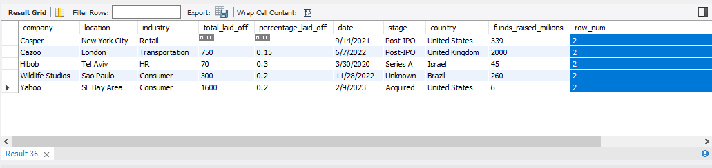

Ejemplo específico de duplicados para la compañía `Oda`:

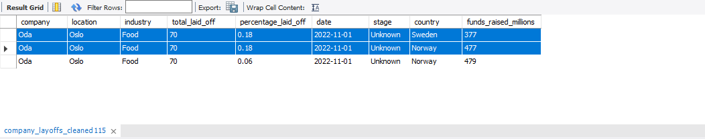  

---

### Dificultades al eliminar duplicados

Durante el proceso, se intentó eliminar los registros duplicados directamente desde una CTE que utilizaba `ROW_NUMBER()`.

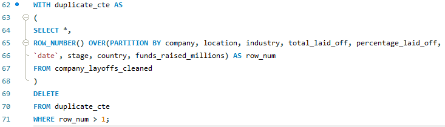

Sin embargo, MySQL arrojó el siguiente error:

**Error 1288:** 
*"The target table of the DELETE is not updatable."*

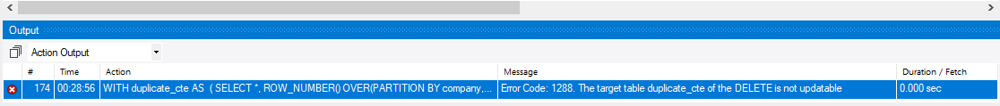

**Causa técnica:**  
MySQL no permite realizar operaciones de eliminación (`DELETE`) directamente sobre tablas derivadas como las CTE (Common Table Expressions), ya que no son actualizables.

**Solución aplicada:**  
Para resolver este inconveniente:

- Se creó una nueva tabla llamada `company_layoffs_cleaned2`, replicando los datos existentes.
- A esta tabla se le agregó manualmente la columna `row_num` como un campo de tipo `INT`.
- Con esta estructura, será posible ejecutar el `DELETE` sin restricciones y eliminar correctamente los registros duplicados.

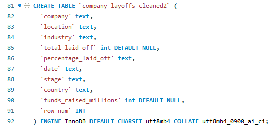
  
---

### Eliminación final de duplicados

Una vez creada `company_layoffs_cleaned2`, se eliminaron todas las filas con `row_num > 1`.

Visualización previa a la eliminación:

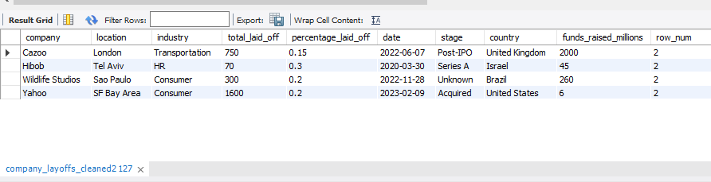

Resultado final tras eliminar duplicados:

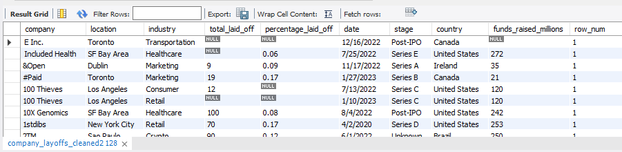

## **PASO 2: Estandarización de Datos**

### Limpieza de espacios en blanco — Columna `company`

Para garantizar la coherencia en los nombres de las compañías, se aplicó la función `TRIM()`, que elimina los espacios en blanco al inicio y al final de los valores.

Esto evita inconsistencias como registros duplicados por pequeñas diferencias invisibles:

Por ejemplo: `" E Inc."` vs `"E Inc."`

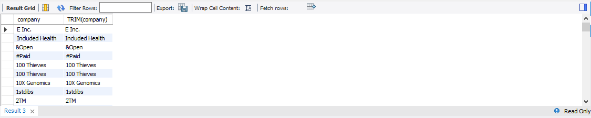

**Estado del dataset tras la estandarización:**

Luego de aplicar `TRIM()`, los nombres de la columna `company` presentan una mayor uniformidad y calidad para el análisis.

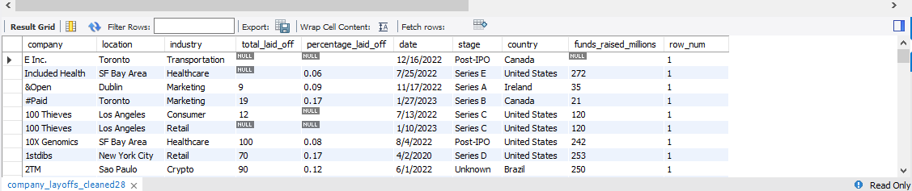

---

### Análisis de la columna `industry`

#### Problema 1: Valores vacíos o `NULL`

Se detectaron varias filas con valores faltantes en la columna `industry`. Esto puede afectar análisis agrupados o categorizaciones por rubro.

📷 Ejemplo de registros con valores nulos:

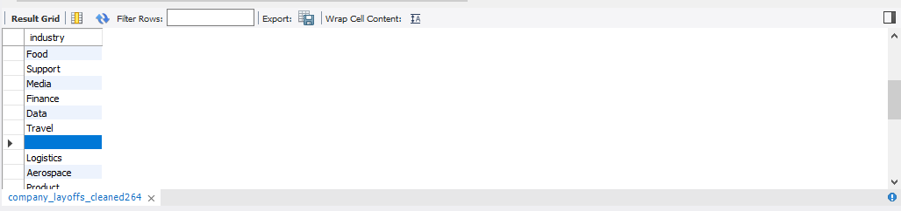  

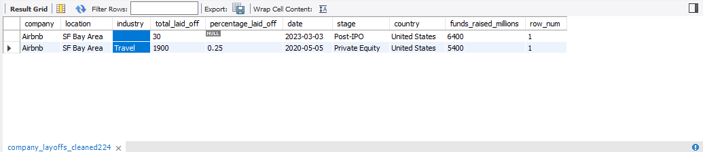

**Solución aplicada:**

- Se completaron los valores `NULL` utilizando información de otras filas de la misma empresa (por ejemplo: si `Airbnb` tiene "Travel" en otra fila, se replica ese valor).
- Si no se encontró información confiable, se dejó el campo como `NULL` para evitar introducir datos incorrectos.

✔ **Resultado:** Reducción de valores nulos sin forzar datos ni introducir sesgos.

---

#### Problema 2: Inconsistencias en los nombres

Se identificaron variantes en los nombres de industrias que, aunque diferentes, representaban la misma categoría (ej: "Crypto", "crypto", "Cryptocurrency").

**Antes de la estandarización:**

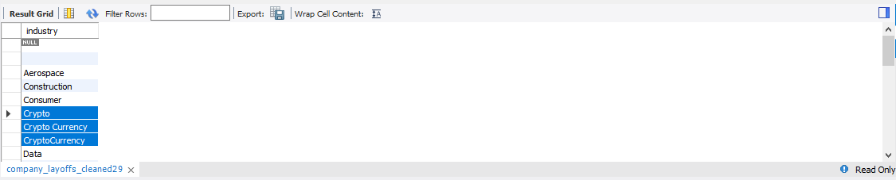

**Después de la estandarización:**

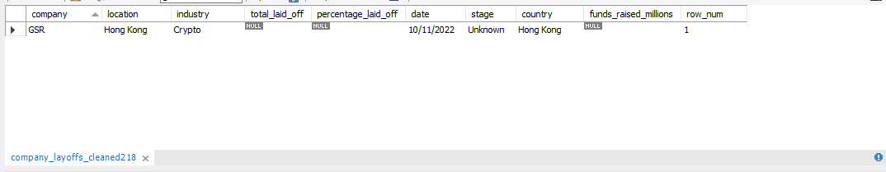

✅ Todos los valores fueron unificados bajo un criterio común para garantizar consistencia en los análisis.

---

### Análisis de la columna `country`

Se eliminaron caracteres innecesarios y se estandarizaron los nombres de países para evitar registros duplicados con distintas formas de escritura.

Por ejemplo: `"United States"` vs `"United States."`

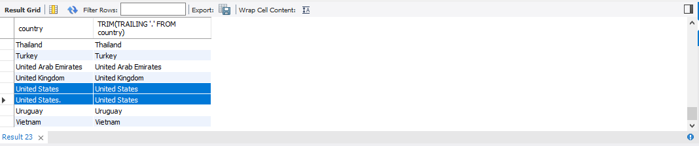

---

### Conversión de la columna `date` a formato fecha

Originalmente, la columna `date` estaba en formato `TEXT`, lo que impedía realizar operaciones como filtrado por fechas o análisis temporal.

Se utilizó la función `STR_TO_DATE()` para convertir los valores y posteriormente se cambió el tipo de dato con `ALTER TABLE`.

📷 **Antes de la conversión:**

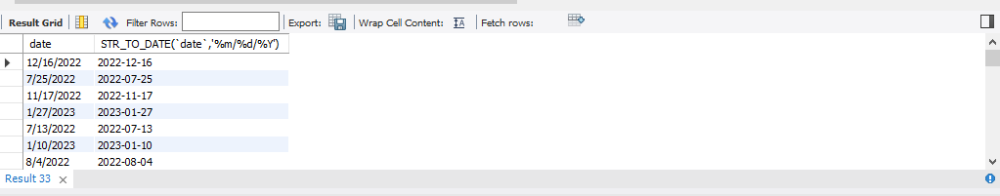

📷 **Después del `UPDATE`:**

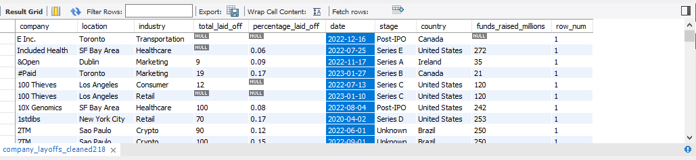

📷 **Cambio de tipo de columna:**

✅ **Resultado final:** `date` ahora está en un formato adecuado para análisis cronológicos y reportes dinámicos.

## PASO 3: Manejo de valores nulos

En esta etapa, identificamos y tratamos los valores faltantes en la columna `industry`.

- **Valores VACÍOS en `industry`**: Se reemplazan los valores vacíos con `NULL`, ya que esto permite un mejor manejo de datos en consultas SQL posteriores.

Para completar los valores faltantes en la columna `industry`, realizamos un **JOIN** con los registros existentes de la misma compañía. De esta forma, si una empresa ya tiene una industria asociada en otra fila, se copia ese valor en las filas donde `industry` es `NULL`.

Después de realizar el `JOIN`, ejecutamos un `SELECT` para comprobar que los valores de la columna `industry` han sido correctamente asignados a las compañías que tenían valores nulos.

Después de aplicar el `UPDATE`, la columna `industry` ha sido actualizada correctamente. Ahora, todas las compañías tienen una industria asignada cuando era posible inferirla a partir de registros existentes.

## PASO 4: Eliminación de datos NULL y columnas innecesarias

En esta etapa, refinamos la base de datos eliminando información que no aporta valor significativo para el análisis final.

E**liminación de datos NULL ( `total_laid_off` y `percentage_laid_off`):** Se eliminan las filas donde `total_laid_off` y `percentage_laid_off` no contienen datos. Aunque podríamos conservarlas, su ausencia genera incertidumbre en el análisis y puede afectar la calidad de las conclusiones.

### **📌 Razones para eliminar estas filas**

✅ **Datos incompletos y sesgo en el análisis:** La falta de valores en variables clave como `total_laid_off` y `percentage_laid_off` impide obtener una visión clara del impacto de los despidos en cada empresa. Si estas filas permanecen, podrían generar sesgos o interpretaciones erróneas.

✅ **Dificultad para la imputación:** No contamos con información suficiente para completar estos datos de manera confiable. Métodos como la imputación por promedio o mediana podrían distorsionar los resultados.

✅ **Impacto en visualizaciones y modelos predictivos:** Mantener datos nulos en métricas clave podría afectar gráficos, dashboards y modelos de Machine Learning, ya que algunas herramientas no manejan bien los valores faltantes.

### **Eliminación de la columna `row_num`**

La columna `row_num` fue utilizada exclusivamente para depuración y ordenamiento temporal durante la limpieza de datos.

En la versión final del dataset, ya no aporta información relevante para el análisis.

Su permanencia solo incrementaría el tamaño del dataset sin un beneficio real.

### **📌 Razones para eliminar esta columna**

✅ **Evitar redundancia y reducir espacio:** Esta columna no tiene valor analítico y solo ocupa espacio en memoria.

✅ **Mejorar eficiencia en consultas:** Al eliminar columnas innecesarias, las consultas SQL son más rápidas y eficientes.

✅ **Facilitar exportación y visualización:** Un dataset más limpio y compacto es más fácil de manejar en herramientas como Tableau, Power BI o Pandas.

## **📊 Resultado Final**

Después de aplicar el proceso de limpieza y transformación, obtenemos un dataset optimizado para análisis.

✔ **Base de datos sin duplicados ni errores:** Se eliminaron inconsistencias y registros redundantes.

✔ **Formato homogéneo y estructurado:** Los datos fueron normalizados para facilitar consultas y visualización.

✔ **Mayor calidad y confiabilidad:** Se redujo la cantidad de valores nulos y se optimizó la estructura de la base de datos.

📎 **🔗 Código completo:** [`data_cleaning.sql`](https://www.notion.so/Data-Cleaning-MySQL-Full-Project-1ac30b66251980089dffda3ae4cf6f72?pvs=21)

📌 *Este proceso es fundamental en cualquier análisis de datos, asegurando información precisa y lista para visualización, reporting y modelado predictivo. 🚀*