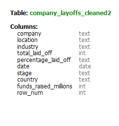
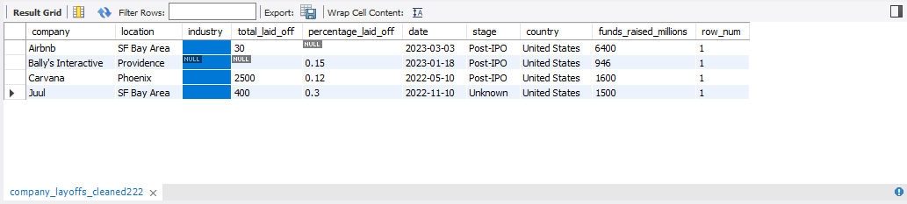
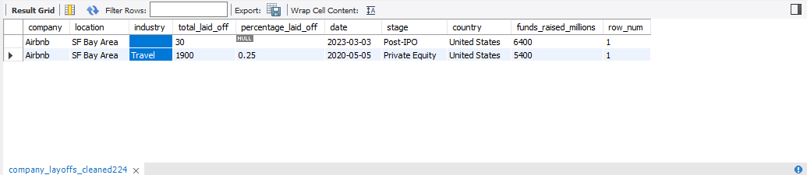
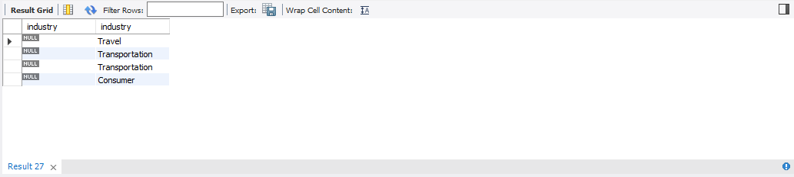
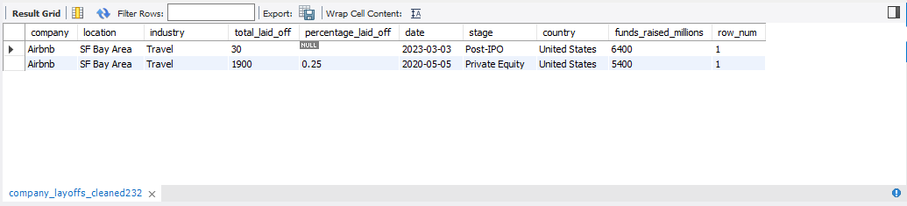
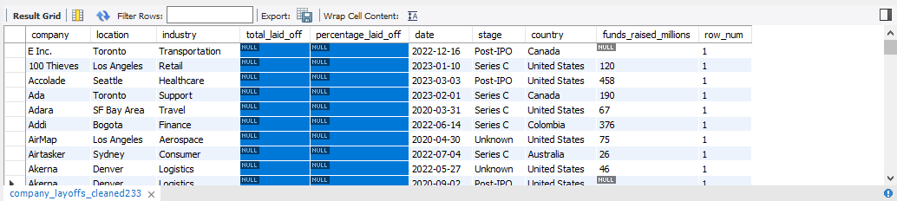

# 📊 Proyecto de Data Cleaning - MySQL

## 📌 Contenido  

1. [Descripción](#Descripción)  
2. [Objetivo](#Objetivo)  
3. [Proceso de limpieza paso a paso](#Proceso-de-limpieza-paso-a-paso)  
   - [PASO 1: Eliminación de Duplicados](#paso-1-eliminación-de-duplicados)  
   - [PASO 2: Estandarización de Datos](#paso-2-estandarización-de-datos)  
   - [PASO 3: Manejo de valores nulos](#paso-3-manejo-de-valores-nulos)  
   - [PASO 4: Eliminación de datos NULL y columnas innecesarias](#paso-4-eliminación-de-datos-null-y-columnas-innecesarias)  
4. [Resultado final](#-resultado-final)  
  
---

## Descripción
Este proyecto muestra cómo **limpiar y preparar una base de datos usando solo SQL**, tal como se hace en escenarios reales de trabajo.  
El dataset original contenía errores comunes como **duplicados, valores vacíos, formatos inconsistentes y columnas innecesarias**.

Durante el proceso se aplicaron pasos clave como:
- **Eliminación de duplicados**  
- **Tratamiento de valores nulos**  
- **Normalización de datos**  
- **Reestructuración de la tabla final**  

Con esto, se obtiene un **dataset confiable y ordenado**, listo para usar en herramientas como **Tableau, Power BI o en modelos de Machine Learning**.

🛠️ **Tecnología usada:** `SQL`  
📊 **Uso práctico:** Dejar los datos **limpios y listos para análisis, visualización o predicción**.

## **Objetivo** 
El objetivo de este proyecto es **mostrar cómo transformar un conjunto de datos desordenado en una base limpia, estructurada y útil para análisis**.

Esto incluye:
- **Detectar y corregir errores** en los datos.
- **Estandarizar campos** para lograr consistencia.  
- Asegurar que la tabla final sea **clara, funcional y reutilizable**.

Es un ejemplo práctico de cómo se trabaja con datos reales en cualquier puesto relacionado con **Data Analysis**, **Business Intelligence** o **Data Engineering**.

--- 

## Proceso de limpieza paso a paso

### 📂 Dataset original

A continuación se muestra una vista previa del dataset recibido:

### 📏 Dimensión del dataset

El conjunto de datos original cuenta con una cantidad significativa de registros y columnas, lo cual hace aún más importante asegurar su calidad antes de analizarlo:

---

## Creación de una tabla de trabajo

Antes de iniciar el proceso de limpieza, se crea una **tabla de trabajo** a partir del dataset original.  
Esta es una buena práctica común en entornos profesionales de análisis de datos, ya que permite trabajar de forma segura, ordenada y sin comprometer la información original.

Se realiza una copia exacta de la estructura y los datos de la tabla `company_layoffs`, creando una nueva tabla llamada `company_layoffs_cleaned`, sobre la cual se aplicarán todas las transformaciones necesarias.

### Ventajas de trabajar con una copia

- **Preservar la fuente de datos original** ante cualquier error o pérdida de información.  
- **Probar distintas técnicas de limpieza** sin afectar el dataset base.  
- **Permitir retrocesos y ajustes rápidos** si se detectan problemas durante el proceso.

---

## PASO 1: Eliminación de Duplicados

Los datos duplicados pueden distorsionar análisis y visualizaciones, generando **resultados incorrectos o inconsistencias**. Para evitar esto, el primer paso del proceso consistió en identificar y eliminar registros repetidos.

### Identificación de duplicados

- Se utilizó la función `ROW_NUMBER()` para asignar un número secuencial a cada fila, agrupando por columnas clave.
- El objetivo fue detectar registros duplicados y conservar solo uno, eliminando aquellos con `row_num > 1`.

Visualización de filas duplicadas identificadas:

Ejemplo específico de duplicados para la compañía `Oda`:

  

---

### Dificultades al eliminar duplicados

Durante el proceso, se intentó eliminar los registros duplicados directamente desde una CTE que utilizaba `ROW_NUMBER()`.

Sin embargo, MySQL arrojó el siguiente error:

**Error 1288:** 
*"The target table of the DELETE is not updatable."*

**Causa técnica:**  
MySQL no permite realizar operaciones de eliminación (`DELETE`) directamente sobre tablas derivadas como las CTE (Common Table Expressions), ya que no son actualizables.

**Solución aplicada:**  
Para resolver este inconveniente:

- Se creó una nueva tabla llamada `company_layoffs_cleaned2`, replicando los datos existentes.
- A esta tabla se le agregó manualmente la columna `row_num` como un campo de tipo `INT`.
- Con esta estructura, será posible ejecutar el `DELETE` sin restricciones y eliminar correctamente los registros duplicados.

  
---

### Eliminación final de duplicados

Una vez creada `company_layoffs_cleaned2`, se eliminaron todas las filas con `row_num > 1`.

Visualización previa a la eliminación:

Resultado final tras eliminar duplicados:

## **PASO 2: Estandarización de Datos**

### Limpieza de espacios en blanco — Columna `company`

Para garantizar la coherencia en los nombres de las compañías, se aplicó la función `TRIM()`, que elimina los espacios en blanco al inicio y al final de los valores.

Esto evita inconsistencias como registros duplicados por pequeñas diferencias invisibles:

Por ejemplo: `" E Inc."` vs `"E Inc."`

**Estado del dataset tras la estandarización:**

Luego de aplicar `TRIM()`, los nombres de la columna `company` presentan una mayor uniformidad y calidad para el análisis.

---

### Análisis de la columna `industry`

#### Problema 1: Valores vacíos o `NULL`

Se detectaron varias filas con valores faltantes en la columna `industry`. Esto puede afectar análisis agrupados o categorizaciones por rubro.

📷 Ejemplo de registros con valores nulos:

  

**Solución aplicada:**

- Se completaron los valores `NULL` utilizando información de otras filas de la misma empresa (por ejemplo: si `Airbnb` tiene "Travel" en otra fila, se replica ese valor).
- Si no se encontró información confiable, se dejó el campo como `NULL` para evitar introducir datos incorrectos.

✔ **Resultado:** Reducción de valores nulos sin forzar datos ni introducir sesgos.

---

#### Problema 2: Inconsistencias en los nombres

Se identificaron variantes en los nombres de industrias que, aunque diferentes, representaban la misma categoría (ej: "Crypto", "crypto", "Cryptocurrency").

**Antes de la estandarización:**

**Después de la estandarización:**

✅ Todos los valores fueron unificados bajo un criterio común para garantizar consistencia en los análisis.

---

### Análisis de la columna `country`

Se eliminaron caracteres innecesarios y se estandarizaron los nombres de países para evitar registros duplicados con distintas formas de escritura.

Por ejemplo: `"United States"` vs `"United States."`

---

### Conversión de la columna `date` a formato fecha

Originalmente, la columna `date` estaba en formato `TEXT`, lo que impedía realizar operaciones como filtrado por fechas o análisis temporal.

Se utilizó la función `STR_TO_DATE()` para convertir los valores y posteriormente se cambió el tipo de dato con `ALTER TABLE`.

📷 **Conversión:**
En la columna izquierda se muestra el formato por defecto de la variable `date`, mientras que en la columna de al lado se muestra la conversión hecha.

📷 **Después del `UPDATE`:**

📷 **Cambio de tipo de columna:**

✅ **Resultado final:** `date` ahora está en un formato adecuado para análisis cronológicos y reportes dinámicos.

## PASO 3: Manejo de valores vacíos

En esta etapa se identificaron y trataron los valores faltantes en la columna `industry`, con el objetivo de mejorar la calidad general del dataset y facilitar consultas más limpias.

### Reemplazo de valores vacíos

Primero, se reemplazaron los valores vacíos (cadenas vacías) por `NULL`. Esto permite manejar de forma más eficiente los datos faltantes en SQL, ya que las funciones y filtros están preparados para interpretar `NULL`, pero no espacios vacíos.

---

### Completado de valores nulos mediante JOIN

Luego, se intentó completar los valores `NULL` en `industry` tomando como referencia otras filas de la misma empresa que sí tenían ese dato.

Se realizó un `JOIN` entre registros de igual contenido de la columna `company`, copiando el valor existente de `industry` en los casos donde faltaba.

📌 Este enfoque evita cargar datos arbitrarios y mantiene la lógica interna del dataset.

---

### Verificación del resultado

Después de realizar el `JOIN`, se ejecutó un `SELECT` para verificar que los valores hayan sido correctamente completados en las filas correspondientes.

---

### Resultado final

Tras aplicar el `UPDATE`, la columna `industry` quedó actualizada. Todas las compañías, `company`, tienen una industria asignada **cuando fue posible inferirla con certeza** a partir de los datos existentes. En este caso, lo que se hizo con el `JOIN` es que para las filas de la companía `Airbnb` se asigna la misma industria `Travel`.

## PASO 4: Eliminación de datos NULL y columnas innecesarias

En esta etapa, se refina el dataset eliminando información que no aporta valor al análisis final. Esto ayuda a mejorar la calidad, la eficiencia y la interpretabilidad del conjunto de datos.

---

### Eliminación de filas con datos faltantes `total_laid_off` y `percentage_laid_off` (condición 'AND')

Se eliminaron todas las filas donde las columnas `total_laid_off` y `percentage_laid_off` estaban vacías. Aunque podrían haberse conservado, su ausencia genera incertidumbre en el análisis y puede distorsionar los resultados.

Antes de la eliminación de filas nulas:

	
Luego de la eliminación de filas nulas:

#### ¿Por qué eliminarlas?

- ✅ **Datos incompletos y riesgo de sesgo:** Estas variables son clave para entender el impacto de los despidos. Mantenerlas vacías debilita cualquier análisis basado en ellas.
- ✅ **Imputación poco confiable:** No hay suficiente contexto para completar los valores sin alterar la integridad del dataset.
- ✅ **Impacto negativo en visualizaciones y modelos:** Algunos dashboards o modelos de Machine Learning no manejan bien los valores `NULL`, lo que puede generar errores o resultados inconsistentes.

---

### Eliminación de la columna `row_num`

La columna `row_num` fue creada exclusivamente para fines de depuración durante los pasos anteriores (por ejemplo, para identificar duplicados). Una vez finalizado ese proceso, dejó de ser útil para el análisis.

#### ¿Por qué eliminarla?

- ✅ **Evitar redundancia:** No aporta información analítica relevante.
- ✅ **Reducir tamaño y limpiar estructura:** Eliminar columnas innecesarias mejora el rendimiento de consultas y simplifica la visualización.
- ✅ **Facilita la exportación a otras herramientas:** Un dataset más liviano es más eficiente para trabajar en Tableau, Power BI, Pandas, etc.

---

## 📊 Resultado Final

Después de aplicar todo el proceso de limpieza y transformación, se obtuvo un dataset **estructurado, confiable y listo para análisis**.

✔ **Sin duplicados ni errores:** Se eliminaron registros redundantes y filas inconsistentes.  
✔ **Formato homogéneo:** Los datos fueron normalizados y las columnas estandarizadas.  
✔ **Mayor calidad y precisión:** Se redujeron valores nulos y se optimizó la estructura general de la base de datos.

📎 **Código completo del proceso:** [`data_cleaning.sql`](https://www.notion.so/Data-Cleaning-MySQL-Full-Project-1ac30b66251980089dffda3ae4cf6f72?pvs=21)
📎 **Código completo del proceso:** [`data_cleaning.sql`](https://www.notion.so/Data-Cleaning-MySQL-Full-Project-1ac30b66251980089dffda3ae4cf6f72?pvs=21)
📎 **Código completo del proceso:** [`data_cleaning.sql`](https://www.notion.so/Data-Cleaning-MySQL-Full-Project-1ac30b66251980089dffda3ae4cf6f72?pvs=21)

*Este tipo de limpieza es una etapa clave en cualquier pipeline de datos, y garantiza una base sólida para visualizaciones, reporting o desarrollo de modelos predictivos.*

---

## 🧩 Posibles mejoras

Aunque el dataset quedó limpio y utilizable, en un entorno real podrían aplicarse mejoras adicionales como:

- Automatizar procesos con scripts SQL parametrizados.  
- Validar entradas con reglas de integridad o triggers.  
- Cruzar el dataset con fuentes externas para completar valores faltantes.  
- Integrar la limpieza en un pipeline ETL más amplio.

💡 *Una demostración práctica de cómo aplicar SQL para resolver problemas reales de datos, con criterio técnico y atención al detalle.*